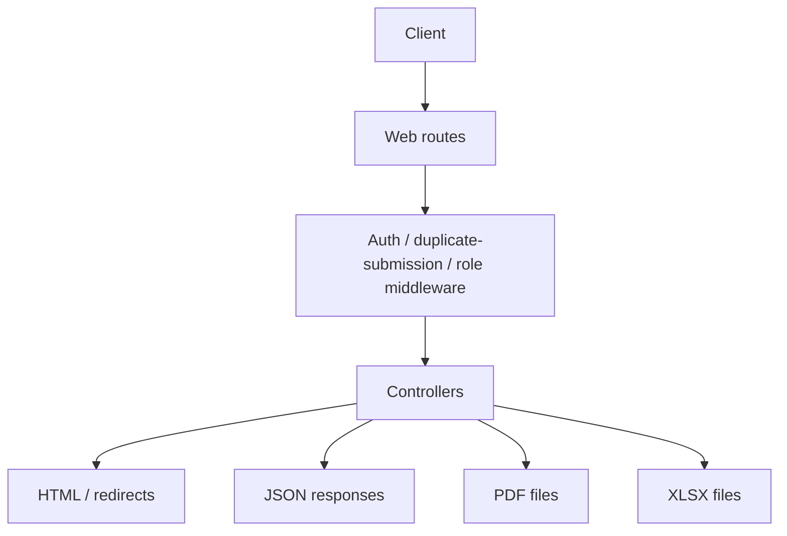

# API Documentation

This repository does not contain a dedicated `routes/api.php` file. The application exposes its callable endpoints through `routes/web.php` and returns a mix of HTML, JSON, PDF, XLSX, and redirect responses.

## Overview

The endpoint surface is organized around authenticated web routes, administrator-only routes, and custom JSON endpoints for datatables, lookups, and status summaries.

## Authentication and Access Control

- Login is handled by `LoginController`.
- Authenticated routes are protected by `auth` plus `prevent.duplicate`.
- Admin-only routes use `role:administrator`.
- Locking and request-unlock actions are guarded by role checks and controller logic.

## Route Categories

### Entry and Authentication

| Method | URI | Controller / Action | Response |
|---|---|---|---|
| GET | `/` | Closure returning the login view | HTML |
| GET | `/login` | `LoginController@login` | HTML |
| POST | `/actionLogin` | `LoginController@actionLogin` | Redirect or validation error |
| POST | `/logout` | `LoginController@logout` | Redirect |

### Dashboard

| Method | URI | Controller / Action | Response |
|---|---|---|---|
| GET | `/dashboard` | `DashboardController@index` via resource route | HTML |
| GET | `/dashboard/kondisi-barang-status` | `DashboardController@kondisiBarangStatus` | JSON |

### Admin Utilities

| Method | URI | Controller / Action | Response |
|---|---|---|---|
| GET | `/admin/backups` | `BackupController@index` | HTML |
| POST | `/admin/backups/full` | `BackupController@runFullBackup` | Redirect / flash |
| POST | `/admin/backups/files-only` | `BackupController@runFilesOnly` | Redirect / flash |
| GET | `/admin/backups/download/{filename}` | `BackupController@download` | File download |
| DELETE | `/admin/backups/delete/{filename}` | `BackupController@destroy` | Redirect / flash |
| GET | `/admin/test-dashboard` | `DashboardController@testDashboard` | HTML |
| POST | `/admin/test-dashboard/run` | `DashboardController@runTests` | JSON / redirect depending on implementation |

### Settings

| Method | URI | Controller / Action | Response |
|---|---|---|---|
| GET | `/settings` | `SettingController@index` | HTML |
| POST | `/settings` | `SettingController@update` | Redirect / flash |

### Activity Logs

| Method | URI | Controller / Action | Response |
|---|---|---|---|
| GET | `/activity-logs` | `ActivityLogController@index` | HTML |
| GET | `/activity-logs/{activity_log}` | `ActivityLogController@show` | HTML |
| GET | `/activity-logs/datatable` | `ActivityLogController@datatable` | JSON |
| GET | `/activity-logs/export` | `ActivityLogController@export` | XLSX |
| POST | `/activity-logs/cleanup` | `ActivityLogController@cleanup` | JSON |

### Master Data Resources

The following resource routes are present and use standard Laravel resource semantics:

| Resource | Controller |
|---|---|
| `bmn` | `BmnController` |
| `satker` | `SatkerController` |
| `barang` | `BarangController` |
| `lokasi` | `LokasiController` |
| `identitas-kategori` | `IdentitasKategoriController` |
| `identitas` | `IdentitasController` |
| `atribut` | `AtributController` |
| `unitkerja` | `UnitKerjaController` |
| `unitteknis` | `UnitTeknisController` |
| `user` | `UserController` |

Most of these resources provide the conventional `index`, `create`, `store`, `edit`, `update`, and `destroy` endpoints. Several `show` methods are intentionally empty or not implemented in the controllers.

### Internal Data

| Method | URI | Controller / Action | Response |
|---|---|---|---|
| GET | `/internal` | `InternalController@index` | HTML |
| GET | `/internal/create` | `InternalController@create` | HTML |
| POST | `/internal` | `InternalController@store` | Redirect / flash or JSON depending on request |
| GET | `/internal/{internal}` | `InternalController@show` | HTML |
| GET | `/internal/{internal}/edit` | `InternalController@edit` | HTML |
| PUT/PATCH | `/internal/{internal}` | `InternalController@update` | Redirect / flash or JSON |
| DELETE | `/internal/{internal}` | `InternalController@destroy` | Redirect / flash or JSON |
| GET | `/internal-data/datatable` | `InternalController@datatable` | JSON |
| GET | `/internal-data/make` | `InternalController@make` | HTML or generated view |
| POST | `/internal/insert` | `InternalController@insert` | Redirect / flash or JSON |
| POST | `/internal/images/store` | `InternalController@addImage` | Redirect / flash or JSON |
| PUT | `/internal/images/{id}/update` | `InternalController@updateImage` | Redirect / flash or JSON |
| DELETE | `/internal/images/{id}/delete` | `InternalController@imageDestroy` | Redirect / flash or JSON |
| POST | `/internal/documents/store` | `InternalController@addDocument` | Redirect / flash or JSON |
| PUT | `/internal/documents/{id}/update` | `InternalController@updateDocument` | Redirect / flash or JSON |
| DELETE | `/internal/documents/{id}/delete` | `InternalController@documentDestroy` | Redirect / flash or JSON |
| GET | `/internal/bast/{id}` | `InternalController@downloadBast` | PDF download |
| GET | `/identitas/kategori/{id}` | `InternalController@kategoriIdentitas` | JSON |
| GET | `/export-data/internal-all` | `InternalController@exportAll` | XLSX |

### SIMAN Data

| Method | URI | Controller / Action | Response |
|---|---|---|---|
| GET | `/siman` | `SimanController@index` | HTML |
| GET | `/siman/create` | `SimanController@create` | HTML |
| POST | `/siman` | `SimanController@store` | Redirect / flash or JSON |
| GET | `/siman/{siman}` | `SimanController@show` | HTML |
| GET | `/siman/{siman}/edit` | `SimanController@edit` | HTML |
| PUT/PATCH | `/siman/{siman}` | `SimanController@update` | Redirect / flash or JSON |
| DELETE | `/siman/{siman}` | `SimanController@destroy` | Redirect / flash or JSON |
| GET | `/siman-data/datatable` | `SimanController@datatable` | JSON |
| DELETE | `/siman/batch/delete` | `SimanController@destroyBatch` | Redirect / flash or JSON |
| POST | `/psp/download` | `PspController@downloadPSP` | PDF download |

### Comparison

| Method | URI | Controller / Action | Response |
|---|---|---|---|
| GET | `/compare` | `CompareController@index` | HTML |
| GET | `/compare/{compare}` | `CompareController@show` | HTML |
| GET | `/compare-data/datatable` | `CompareController@datatable` | JSON |
| GET | `/export-data/internal` | `CompareController@exportInternalOnly` | XLSX |
| GET | `/export-data/siman` | `CompareController@exportSimanOnly` | XLSX |
| GET | `/export-data/match-tgl-misnilai` | `CompareController@exportMatchTgl` | XLSX |
| GET | `/export-data/match-nilai-mistgl` | `CompareController@exportMatchNilai` | XLSX |
| GET | `/export-data/match` | `CompareController@exportMatch` | XLSX |
| GET | `/export-data/match-nup-mistgl-misnilai` | `CompareController@exportNupMatch` | XLSX |

### Invalid Data

| Method | URI | Controller / Action | Response |
|---|---|---|---|
| GET | `/invalid` | `InvalidController@index` | HTML |
| GET | `/invalid/create` | `InvalidController@create` | HTML |
| POST | `/invalid` | `InvalidController@store` | Redirect / flash or JSON |
| GET | `/invalid/{invalid}` | `InvalidController@show` | HTML |
| GET | `/invalid/{invalid}/edit` | `InvalidController@edit` | HTML |
| PUT/PATCH | `/invalid/{invalid}` | `InvalidController@update` | Redirect / flash or JSON |
| DELETE | `/invalid/{invalid}` | `InvalidController@destroy` | Redirect / flash or JSON |
| DELETE | `/invalid` | `InvalidController@destroyBatch` | Redirect / flash or JSON |
| GET | `/invalid-data/datatable` | `InvalidController@datatable` | JSON |
| GET | `/export-data/invalid` | `InvalidController@exportInvalid` | XLSX |

### Locked Data

| Method | URI | Controller / Action | Response |
|---|---|---|---|
| GET | `/internal/locked` | `LockedDataController@index` | HTML |
| GET | `/internal/locked/datatable` | `LockedDataController@datatable` | JSON |
| PUT | `/internal/{id}/lock` | `LockedDataController@lock` | JSON or redirect |
| PUT | `/internal/{id}/unlock` | `LockedDataController@unlock` | JSON or redirect |
| PUT | `/internal/{id}/requestUnlock` | `LockedDataController@requestUnlock` | JSON or redirect |
| PUT | `/internal/{id}/reject-request` | `LockedDataController@rejectRequest` | JSON or redirect |

## Response Types

The application returns several response types depending on the endpoint:

- HTML views for standard pages
- JSON for DataTables feeds and status endpoints
- XLSX files for exports through OpenSpout
- PDF files for BAST and PSP downloads through DomPDF
- Redirects with flash messages for standard form submissions

## Authorization and Middleware Expectations

- Authenticated routes require a valid Laravel session.
- Administrator routes require a user whose level name resolves to `administrator`.
- Write requests can be blocked if the duplicate-submission middleware sees the same fingerprint within 5 seconds.

## Practical API Usage Notes

- Because there is no `routes/api.php`, consumers should treat the web routes as the application endpoint surface.
- Datatable endpoints are the primary JSON interfaces used by the frontend.
- Export routes are file-oriented endpoints rather than JSON APIs.
- Several resource controllers contain empty `show` methods, so those routes exist but do not provide meaningful page content in every case.
