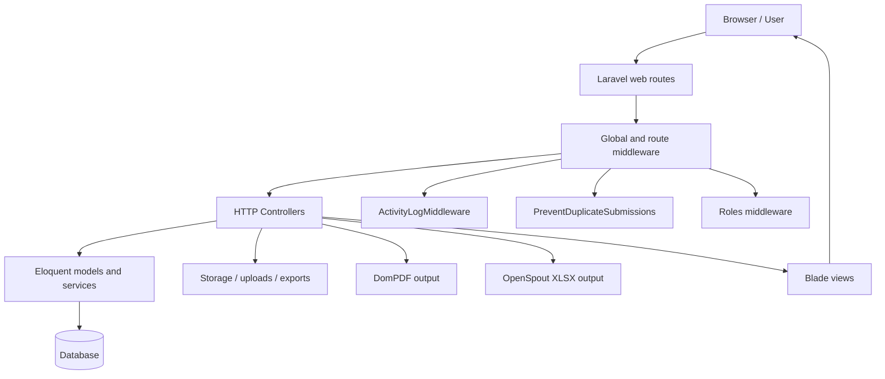
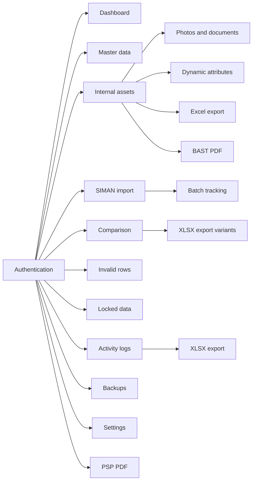

# Architecture

This document describes the architecture that is actually present in the repository. It is based on the Laravel 12 code under `app/`, `bootstrap/`, `config/`, `database/`, `resources/`, and `routes/`.

## Overview

SIMAN App is a Blade-driven Laravel application for managing internal asset records, SIMAN imports, invalid import rows, comparison reports, activity logs, backups, and document generation. The application uses server-rendered pages, custom middleware, database-backed sessions and queues, and file exports in PDF and XLSX formats.

## High-Level Flow

## Main Layers

### HTTP Layer

The HTTP surface is defined in [`routes/web.php`](../routes/web.php). The application uses standard Laravel routing with:

- a login entry point
- an authenticated protected area
- an administrator-only subgroup
- resource controllers for master data and operational data
- custom datatable, export, lock, unlock, and batch actions

### Middleware Layer

The middleware stack is part of the runtime architecture, not just configuration.

- [`ActivityLogMiddleware`](../app/Http/Middleware/ActivityLogMiddleware.php) runs globally and writes request metadata to the `activity_logs` table.
- [`PreventDuplicateSubmissions`](../app/Http/Middleware/PreventDuplicateSubmissions.php) blocks repeated POST, PUT, and PATCH submissions using a cache-based fingerprint.
- [`Roles`](../app/Http/Middleware/Roles.php) enforces role-based access using the authenticated user’s `level_name`.

### Controller Layer

The controller layer is the primary application logic surface.

- Authentication is handled by [`LoginController`](../app/Http/Controllers/LoginController.php).
- Dashboard summaries are handled by [`DashboardController`](../app/Http/Controllers/DashboardController.php).
- Reference data CRUD is handled by controllers such as [`BmnController`](../app/Http/Controllers/BmnController.php), [`BarangController`](../app/Http/Controllers/BarangController.php), [`SatkerController`](../app/Http/Controllers/SatkerController.php), [`LokasiController`](../app/Http/Controllers/LokasiController.php), [`IdentitasController`](../app/Http/Controllers/IdentitasController.php), [`IdentitasKategoriController`](../app/Http/Controllers/IdentitasKategoriController.php), [`AtributController`](../app/Http/Controllers/AtributController.php), [`UnitKerjaController`](../app/Http/Controllers/UnitKerjaController.php), [`UnitTeknisController`](../app/Http/Controllers/UnitTeknisController.php), and [`UserController`](../app/Http/Controllers/UserController.php).
- Import and operational workflows are handled by [`InternalController`](../app/Http/Controllers/InternalController.php), [`SimanController`](../app/Http/Controllers/SimanController.php), [`CompareController`](../app/Http/Controllers/CompareController.php), [`InvalidController`](../app/Http/Controllers/InvalidController.php), [`LockedDataController`](../app/Http/Controllers/LockedDataController.php), and [`PspController`](../app/Http/Controllers/PspController.php).
- Administrative utilities are handled by [`BackupController`](../app/Http/Controllers/BackupController.php), [`ActivityLogController`](../app/Http/Controllers/ActivityLogController.php), and [`SettingController`](../app/Http/Controllers/SettingController.php).

### Model and Service Layer

The core domain is concentrated in Eloquent models such as [`DataInternal`](../app/Models/DataInternal.php), [`simanData`](../app/Models/simanData.php), [`InvalidData`](../app/Models/InvalidData.php), [`ImportRun`](../app/Models/ImportRun.php), [`ActivityLog`](../app/Models/ActivityLog.php), and [`Setting`](../app/Models/Setting.php).

The import idempotency workflow is encapsulated in [`ImportIdempotencyService`](../app/Services/ImportIdempotencyService.php).

## Domain Modules

### Authentication

- Uses the `web` guard and the `User` model.
- Login regenerates the session after successful authentication.
- Logout invalidates the session and regenerates the CSRF token.

### Master Data

The application keeps several reference tables for asset metadata and organization structure:

- BMN
- barang
- satker
- lokasi ruang
- identitas category
- identitas
- atribut
- unit kerja
- unit teknis
- users

### Internal Asset Workflow

The internal asset module is centered on `DataInternal` and its related tables.

Observed responsibilities include:

- CSV import
- manual insertion and update
- attachment management
- location, unit, and identity metadata assignment
- lock / unlock / request unlock state changes
- Excel export
- BAST PDF generation

### SIMAN Workflow

The SIMAN module imports external data into `siman_data`, tracks batch groups in `siman_batches`, and exposes comparison data used by the dashboard and compare screens.

### Comparison Workflow

Comparison logic is implemented in the controller layer and compares internal data against SIMAN data using keys such as `barang_id`, `nup`, `nilai_aset` / `nilai_perolehan`, and `tgl_perolehan`.

### Logging and Backups

- Request metadata is captured by the global activity log middleware.
- Activity logs can be filtered, exported, and cleaned up.
- Backups are implemented as ZIP archives containing the configured project paths and a MySQL dump when available.

## Runtime Infrastructure

### Scheduling

`app/Console/Kernel.php` schedules two commands:

- `backup:run` every 3 months on the 1st day at 00:00
- `activity-logs:cleanup` daily at 01:00

### Queue / Session / Cache

The architecture uses database-backed infrastructure for sessions, queues, and cache storage. The related tables exist in the migration set.

### Storage

The application uses the local filesystem and the public storage symlink for uploaded files, generated exports, and backup archives.

## Third-Party Packages In the Architecture

- DomPDF for PDF generation
- OpenSpout for XLSX exports
- Yajra DataTables for server-side table responses
- RealRashid SweetAlert for flash notifications
- Vite and Tailwind CSS 4 for frontend assets

## Notes on Implementation Style

- The project is Blade-first and server-rendered.
- It does not expose a dedicated API route file.
- The codebase contains a number of intentionally empty resource methods, so the architecture is closer to a targeted back-office system than a full generic CRUD scaffold.
