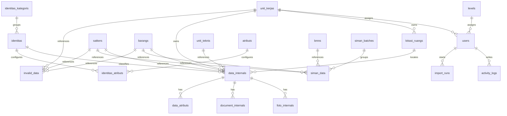

# Database Documentation

This document records the database schema that is actually defined in the migration files in `database/migrations`.

## Overview

The schema is centered on internal asset management. It includes framework tables for sessions, cache, jobs, and password reset tokens, plus application tables for assets, SIMAN imports, invalid rows, attachments, identity metadata, activity logging, settings, and import idempotency.

## Entity Relationship Overview

## Framework Tables

| Table | Columns / Constraints | Notes |
|---|---|---|
| `users` | `id`, `name`, `email` unique, `email_verified_at`, `password`, `remember_token`, timestamps, later `level_id`, `unit_kerja_id` | Authenticated users for the web guard |
| `password_reset_tokens` | `email` primary key, `token`, `created_at` | Laravel password reset storage |
| `sessions` | `id` primary key, `user_id`, `ip_address`, `user_agent`, `payload`, `last_activity` | Database-backed sessions |
| `cache` | `key` primary key, `value`, `expiration` | Cache storage |
| `cache_locks` | `key` primary key, `owner`, `expiration` | Cache lock storage |
| `jobs` | queue columns for payload, attempts, reserved/available timestamps | Database queue backend |
| `job_batches` | `id` primary key, batch counters, failed job ids, options, timestamps | Queue batch metadata |
| `failed_jobs` | `uuid` unique, connection, queue, payload, exception, failed_at | Failed queue jobs |

## Reference Tables

| Table | Columns / Constraints | Notes |
|---|---|---|
| `levels` | `id`, `level_name` | Used by user role checks |
| `unit_kerjas` | `id`, `name`, `nameId` unique and nullable | Organizational unit lookup |
| `unit_teknis` | `id`, `name`, `slug` unique | Technical unit lookup |
| `bmns` | `id`, `name` unique | BMN lookup |
| `satkers` | `id`, `kode_satker` unique, `nama_satker` unique and nullable | Satker lookup |
| `barangs` | `id`, `kode_barang`, `nama_barang`, `nup` nullable | Barang reference table |
| `lokasi_ruangs` | `id`, `unit_kerja_id` nullable, `name` nullable | Room/location lookup |
| `settings` | `id`, `key` unique, `value` nullable | Application settings |

## Identity and Attribute Tables

| Table | Columns / Constraints | Notes |
|---|---|---|
| `identitas_kategoris` | `id`, `name`, `slug` unique | Identitas grouping table |
| `identitas` | `id`, `kategori_id` nullable, `name`, `slug` unique | Identity template table |
| `atributs` | `id`, `key` unique, `label`, `data_type` | Attribute definitions |
| `identitas_atributs` | `identitas_id`, `atributs_id`, `is_required`, `sort_order`, `placeholder`, `help_text`, unique pair on identity + attribute | Pivot metadata for identity forms |
| `data_atributs` | `data_internal_id`, `atributs_id`, `value_string`, `value_integer`, `value_date`, unique pair on internal + attribute, indexes on attribute/value columns | Typed custom values for `DataInternal` |

## Internal Asset Tables

| Table | Columns / Constraints | Notes |
|---|---|---|
| `data_internals` | `satker_id`, `barang_id`, `unit_kerja_id`, `lokasi_id`, `identitas_id`, `pengguna_unitkerja_id`, `unit_teknis_id`, `nup`, `tgl_perolehan`, `merk`, `tipe`, `jumlah`, `nilai_aset`, `nilai_penyusutan`, `nilai_buku`, `kondisi`, `akun_neraca`, `pembukuan`, `penggunaRaw`, `status_inven`, `update_kondisi`, `link_dokumentasi`, `link_lhi`, `no_bahi`, `tgl_bahi`, `kode_registrasi`, `siman_id`, `batch`, `label`, `profile_image`, `profile_image_path`, `nama_pengguna`, later `status`, `ket_lokasi`, `ket_penugasan`, `ket_unit_teknis`, `is_requested`, `is_borrowed`, `nip_pengguna`, `alamat_pengguna`, `jabatan_pengguna`, `nama_pihak_pertama`, `nip_pihak_pertama`, `jabatan_pihak_pertama`, `alamat_pihak_pertama` | Core internal asset record table; unique pair on `barang_id` + `nup` |
| `foto_internals` | `data_internal_id`, `filename`, `path`, `title`, `description`, `is_cover` | Internal asset photos |
| `document_internals` | `data_internal_id`, `filename`, `path`, `title`, `description` | Internal asset documents |

## SIMAN Tables

| Table | Columns / Constraints | Notes |
|---|---|---|
| `siman_batches` | `id`, `label` nullable, `source` nullable, timestamps | SIMAN import batch grouping |
| `siman_data` | `bmn_id`, `satker_id`, `import_batch_id`, `barang_id`, `nup`, `merk`, `tipe`, `kondisi`, `no_dokumen`, `no_BPKP`, `no_polisi`, `no_sertifikat`, `tgl_perolehan`, `nilai_perolehan`, `nilai_penyusutan`, `nilai_buku`, `kode_register` unique and nullable, `lokasi_ruang`, `update_lokasi_ruang`, `update_kondisi`, `nama_pengguna`, `link_dokumentasi`, `opname` | Imported SIMAN asset rows |
| `import_runs` | `source`, `fingerprint` unique, `user_id` nullable, `batch_label`, `batch_type`, `batch_id`, `status`, `response_status`, `response_payload`, `error_message`, `started_at`, `finished_at` | Import idempotency and replay protection |

## Invalid Data Table

| Table | Columns / Constraints | Notes |
|---|---|---|
| `invalid_data` | `satker_id`, `barang_id`, `nup`, `tgl_perolehan`, `merkRaw`, `merk`, `tipe`, `jumlah`, `nilai_aset`, `nilai_penyusutan`, `nilai_buku`, `kondisi`, `akun_neraca`, `pembukuan`, `unit_kerja_id`, `pengguna`, `lokasi_ruang`, `status_inven`, `update_kondisi`, `link_dokumentasi`, `link_lhi`, `no_bahi`, `tgl_bahi`, `kode_registrasi`, `siman_id`, `batch`, `label`, `description` | Stores rejected or not-yet-valid import rows |

## Activity and Operational Tables

| Table | Columns / Constraints | Notes |
|---|---|---|
| `activity_logs` | `user_id` nullable, `method`, `uri`, `route_name` nullable, `route_parameters` json nullable, `status_code`, `response_content` nullable, `ip_address`, `user_agent`, timestamps; foreign key to `users` with `set null` on delete | Request audit log |
| `settings` | `key` unique, `value` nullable | General application settings |

## Important Constraints and Indexes

- `data_internals` has a unique constraint on `barang_id` + `nup`.
- `data_atributs` has a unique constraint on `data_internal_id` + `atributs_id`.
- `identitas_atributs` has a unique constraint on `identitas_id` + `atributs_id`.
- `siman_data.kode_register` is unique.
- `import_runs.fingerprint` is unique.
- `activity_logs` has indexes on `created_at`, `user_id`, and `method`.
- `satkers.kode_satker`, `unit_teknis.slug`, `identitas.slug`, and `settings.key` are unique.

## Relationship Notes

- `User` belongs to `Level` and `UnitKerja`.
- `DataInternal` belongs to `satker`, `Barang`, `UnitKerja`, `LokasiRuang`, `Identitas`, and `UnitTeknis` references, and has many `FotoInternal`, `DocumentInternal`, and `DataAtribut` rows.
- `Identitas` belongs to `IdentitasKategori` and relates to `Atribut` through `identitas_atributs`.
- `simanData` belongs to `bmn`, `satker`, `SimanBatch`, and `Barang`.
- `InvalidData` belongs to `bmn`, `satker`, `Barang`, and `UnitKerja`.

## Database Usage Patterns

- The application uses database-backed sessions and queues by default.
- Activity log rows are written automatically by middleware.
- Import runs track duplicate uploads by fingerprint.
- Backups and exports interact with the filesystem rather than storing binary blobs in the database.
