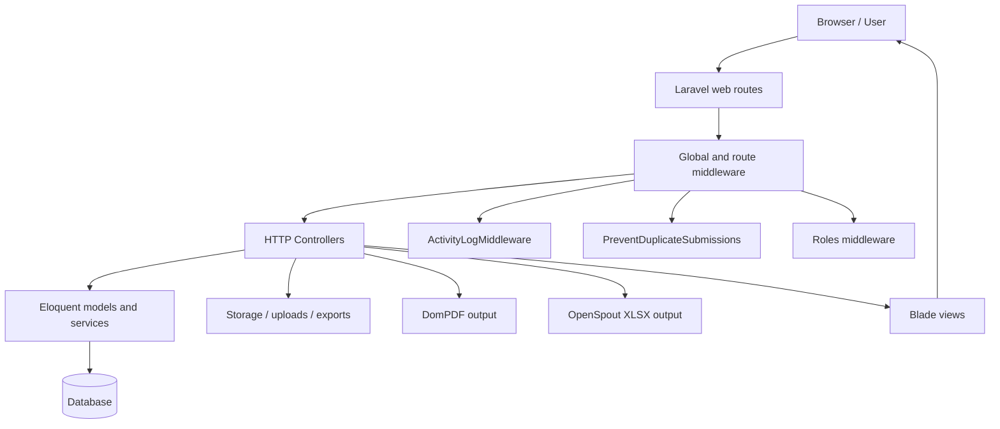
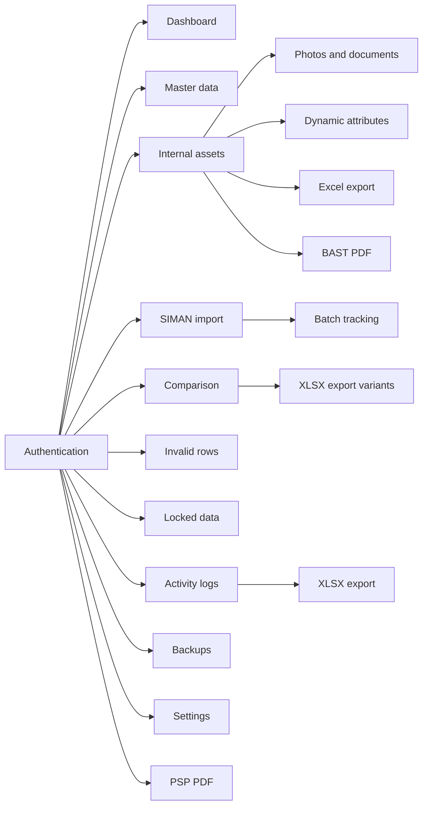
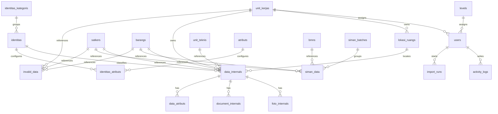
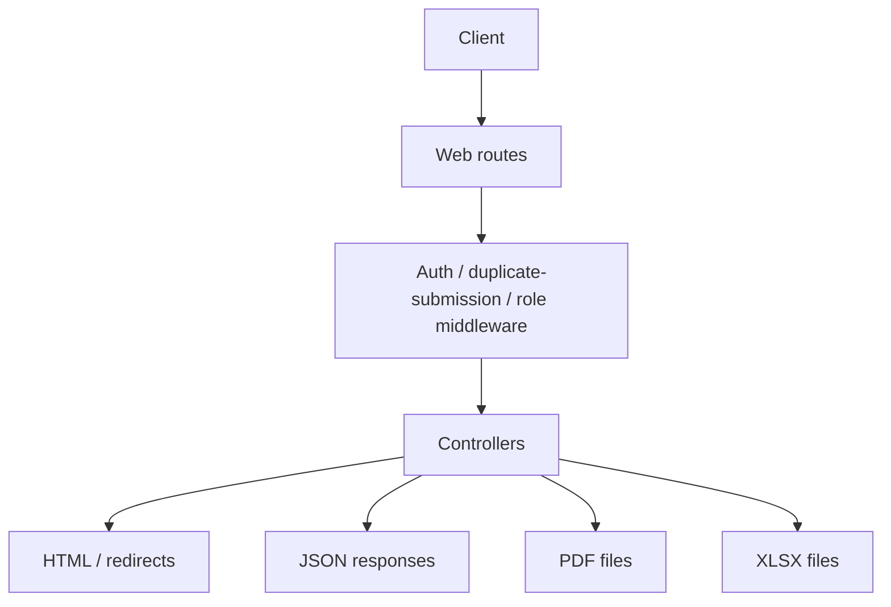

# Project Documentation

This document combines the repository documentation that was generated from the current workspace into a single reference. It is based on the audited code, migrations, routes, controllers, models, config, and supporting docs in this project.

## Source Documents

- [Project Audit](Project_Audit.md)
- [Architecture](Architecture.md)
- [Database Documentation](Database_Documentation.md)
- [API Documentation](API_Documentation.md)
- [Security Assessment](Security_Assessment.md)

## Executive Summary

SIMAN App is a Blade-driven Laravel 12 application for internal asset management, SIMAN imports, invalid-row handling, comparison reporting, activity logging, backups, and document generation. The project uses server-rendered pages, custom middleware, database-backed sessions and queues, and PDF/XLSX export workflows.

The strongest operational controls are Laravel session authentication, route-level role checks, and broad request validation. The highest-risk areas are public upload exposure, unsafe backup path handling, and default seeded administrator credentials.

## Architecture

This section summarizes the application structure and runtime flow.

### Main Layers

The HTTP surface lives in `routes/web.php` and is organized into login, authenticated application routes, administrator-only utilities, and custom JSON/export endpoints.

The middleware stack is part of the runtime architecture:

- `ActivityLogMiddleware` records request metadata into `activity_logs`.
- `PreventDuplicateSubmissions` blocks repeated POST, PUT, and PATCH requests using a cache fingerprint.
- `Roles` enforces role-based access from the authenticated user’s `level_name`.

The controller layer contains the actual application logic for authentication, dashboards, master data, internal assets, SIMAN imports, comparison workflows, invalid data handling, locked-data management, activity logs, backups, settings, and PSP PDF generation.

The model and service layer is centered on `DataInternal`, `simanData`, `InvalidData`, `ImportRun`, `ActivityLog`, `Setting`, and `ImportIdempotencyService`.

### Domain Modules

### Runtime Infrastructure

- Sessions and queues use the database driver by default.
- Backups are scheduled by `app/Console/Kernel.php`.
- The application uses local storage and the public storage symlink for uploads and generated files.
- DomPDF, OpenSpout, Yajra DataTables, and SweetAlert are the main runtime integrations.

## Database Documentation

The schema is centered on internal asset management. It includes framework tables for sessions, cache, and jobs, plus application tables for assets, SIMAN imports, invalid rows, attachments, identity metadata, activity logging, settings, and import idempotency.

### Core Tables

| Table | Purpose |
|---|---|
| `users` | Authenticated web users, later extended with `level_id` and `unit_kerja_id` |
| `sessions` | Database-backed session storage |
| `cache` / `cache_locks` | Cache and lock storage |
| `jobs` / `job_batches` / `failed_jobs` | Queue and batch metadata |
| `levels` / `unit_kerjas` / `unit_teknis` / `bmns` / `satkers` / `barangs` / `lokasi_ruangs` | Reference data |
| `identitas_kategoris` / `identitas` / `atributs` / `identitas_atributs` / `data_atributs` | Dynamic identity and attribute definitions |
| `data_internals` / `foto_internals` / `document_internals` | Internal asset records and attachments |
| `siman_batches` / `siman_data` | SIMAN import batches and rows |
| `invalid_data` | Rejected import rows |
| `activity_logs` | Request audit trail |
| `settings` | Key/value application settings |
| `import_runs` | Import idempotency and replay protection |

### Important Constraints

- `data_internals` has a unique pair on `barang_id` and `nup`.
- `data_atributs` has a unique pair on `data_internal_id` and `atributs_id`.
- `identitas_atributs` has a unique pair on `identitas_id` and `atributs_id`.
- `siman_data.kode_register` is unique.
- `import_runs.fingerprint` is unique.
- `activity_logs` is indexed for practical filtering and cleanup.

## API Documentation

The repository does not contain a dedicated `routes/api.php` file. The callable surface is exposed through `routes/web.php` and returns HTML, JSON, PDF, XLSX, and redirect responses.

### Route Categories

- Entry and authentication routes cover login, logout, and the root login screen.
- Dashboard routes expose summary pages and a JSON condition endpoint.
- Administrator routes cover backups, settings, activity logs, test helpers, and destructive batch actions.
- Master data resources provide conventional CRUD surfaces for lookup tables.
- Internal data routes cover asset management, attachments, BAST download, and datatable feeds.
- SIMAN routes cover import, listing, datatable access, and batch deletion.
- Comparison routes expose match and export flows.
- Invalid-data routes expose review, fix-up, deletion, and export flows.
- Locked-data routes expose lock, unlock, request unlock, and rejection actions.

### Response Types

- HTML for standard pages
- JSON for datatable and status endpoints
- XLSX for exports through OpenSpout
- PDF for BAST and PSP downloads through DomPDF
- Redirects with flash messages for form submissions

### Practical Notes

- There is no separate API-only route file.
- Datatable endpoints are the primary JSON interface for the frontend.
- Several resource controllers intentionally leave `show` unimplemented.

## Security Assessment

The application has strong baseline controls, including Laravel authentication, role checks, request validation, and session regeneration on login. The main security concerns are public file exposure, unsafe backup path handling, and default seeded administrator credentials.

### Findings

| Severity | Area | Finding | Impact |
|---|---|---|---|
| High | Authentication | A default administrator account is seeded with a known email and password. | Immediate administrative compromise if not changed. |
| High | File uploads / data exposure | Internal uploads are stored on the public filesystem and exposed through public URLs. | Sensitive asset documents and images may be directly retrievable. |
| High | File handling | Backup download and delete paths are built from an unvalidated filename route parameter. | Path traversal or unauthorized file access/deletion risk. |
| Medium | File uploads | Storage filenames are built from user-controlled values. | Unsafe path construction and unpredictable file management. |
| Medium | Session handling | Sessions are database-backed and not encrypted by default. | Database compromise can expose session contents unless production hardening is strong. |

### Recommended Remediation

1. Remove or localize the default admin bootstrap account.
2. Move sensitive uploads off the public disk and serve them through authenticated controllers.
3. Validate backup filenames with a strict allowlist and real-path checks.
4. Sanitize or replace user-derived storage name components.
5. Enforce secure-cookie and HTTPS settings in production.

## Consolidated Project Audit

This section captures the broad repository audit so the merged document remains self-contained.

### Platform Baseline

The project targets PHP `^8.2`, Laravel `^12.0`, database-backed sessions and queues, and a Blade/Vite/Tailwind frontend stack. Major runtime packages include DomPDF, Intervention Image, OpenSpout, SweetAlert, Bootstrap Icons, and Yajra DataTables.

### Application Structure

The repository is organized as a back-office application with login, dashboard, master-data CRUD, internal asset workflows, SIMAN import/comparison, invalid-row processing, activity logs, backups, settings, and PSP PDF generation.

### Runtime and Configuration

- Web routes are loaded from `routes/web.php`.
- `ActivityLogMiddleware` is registered globally.
- Middleware aliases include `role` and `prevent.duplicate`.
- `APP_DEBUG` defaults to false and `APP_ENV` defaults to production.
- `SESSION_DRIVER` and `QUEUE_CONNECTION` default to database.

### Controllers, Models, and Services

- Authentication is handled by `LoginController`.
- Backups are handled by `BackupController`.
- Activity logs are handled by `ActivityLogController`.
- Internal assets are handled by `InternalController`.
- SIMAN data is handled by `SimanController`.
- Comparison is handled by `CompareController`.
- Invalid data is handled by `InvalidController`.
- Locked data is handled by `LockedDataController`.
- PSP generation is handled by `PspController`.

The model layer centers on `DataInternal`, `simanData`, `InvalidData`, `ImportRun`, `ActivityLog`, `Setting`, `User`, `Level`, `UnitKerja`, `UnitTeknis`, `Barang`, `satker`, `bmn`, `LokasiRuang`, `Identitas`, `IdentitasKategori`, `Atribut`, `DataAtribut`, `FotoInternal`, `DocumentInternal`, `Pengguna`, `SimanBatch`, and `InternalBatch`.

### Testing and Gaps

- No `routes/api.php` exists.
- No `tests/` directory exists.
- No `app/Mail` or `app/Jobs` directory exists.
- No request, event, listener, or notification classes were present.

## Appendix: Operational Notes

- The codebase is intentionally server-rendered and not API-first.
- PDF and XLSX export flows are a core part of the application design.
- The most important risks are in upload storage, backup handling, and seeded credentials rather than in a missing API layer.
